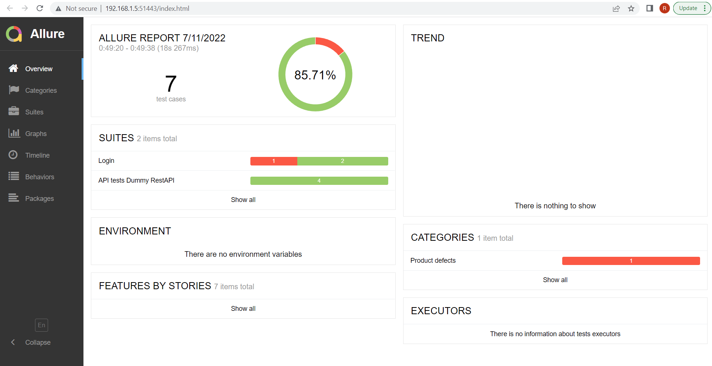

# PopRaluca_MD_challenge

## Installation

Clone the repository and run `npm i` in repository root.

## Running tests

```sh
npm run test-api-and-fe
```

## Running cypress test runner
```sh
npx cypress open
```

#### To generate and open Allure report

```sh
npm run report
```
In case of allure report does not work locally, right click on index.html from allure-report directory, and select "Open with live server"
Required extension for live server: "Live Server"

